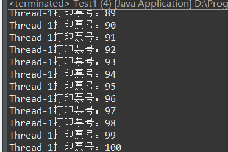
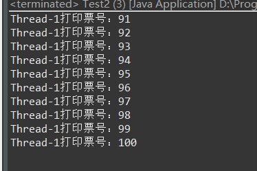
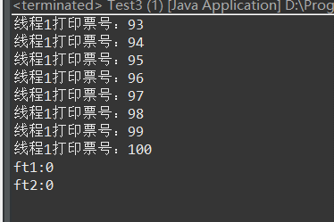

# 148-Java-创建线程类的三种方式.md

第一种：

```
package 创建线程类的三种方式;
/**
 * 
* <p>Title: SaleTicket</p>  
* <p>
* Description: 
* 创建线程类的第一种方式:
* 实现Runable接口
* </p>  
* @author xianxian 
* @date 2019年7月17日
 */
public class SaleTicket1 implements Runnable {

	@Override
	public void run() {

		for (int i = 0; i <= 100; i++) {
			System.out.println(Thread.currentThread().getName() + "打印票号：" + i);
		}
	}
}
```
```
package 创建线程类的三种方式;
/**
 * 
* <p>Title: Test1</p>  
* <p>
* 	Description: 
* 测试第一种方式创建的线程类
* </p>  
* @author xianxian 
* @date 2019年7月17日
 */
public class Test1 {

	public static void main(String[] args) {
		SaleTicket1 s1 = new SaleTicket1();
		Thread t1 = new Thread(s1);
		t1.start();
		
		SaleTicket1 s2 = new SaleTicket1();
		Thread t2 = new Thread(s2);
		t2.start();
	}
}
```
测试结果如下：



第二种：

```
package 创建线程类的三种方式;
/**
 * 
* <p>Title: SaleTicket2</p>  
* <p>
* 	Description: 
* 创建线程类的第二种方式：
* 继承Thread类
* </p>  
* @author xianxian 
* @date 2019年7月17日
 */
public class SaleTicket2 extends Thread {

	@Override
	public void run() {
		for (int i = 0; i <= 100; i++) {
			System.out.println(Thread.currentThread().getName() + "打印票号：" + i);
		}
	}
}
```
```
package 创建线程类的三种方式;
/**
 * 
* <p>Title: Test1</p>  
* <p>
* 	Description: 
* 测试第二种方式创建的线程类
* </p>  
* @author xianxian 
* @date 2019年7月17日
 */
public class Test2 {

	public static void main(String[] args) {
		SaleTicket2 s1 = new SaleTicket2();
		s1.start();
		
		SaleTicket2 s2 = new SaleTicket2();
		s2.start();
	}
}
```
测试结果如下：



第三种：

```
package 创建线程类的三种方式;

import java.util.concurrent.Callable;
/**
 * 
* <p>Title: SaleTicket3</p>  
* <p>
* 	Description: 
* 有返回值的线程类
* </p>  
* @author xianxian 
* @date 2019年7月17日
 */
public class SaleTicket3 implements Callable<Integer> {

	@Override
	public Integer call() throws Exception {
		for (int i = 0; i <= 100; i++) {
			System.out.println(Thread.currentThread().getName() + "打印票号：" + i);
		}
		return 0;
	}
}
```
```
package 创建线程类的三种方式;

import java.util.concurrent.ExecutionException;
import java.util.concurrent.FutureTask;

/**
 * 
* <p>Title: Test1</p>  
* <p>
* 	Description: 
* 测试第三种方式创建的线程类
* </p>  
* @author xianxian 
* @date 2019年7月17日
 */
public class Test3 {

	public static void main(String[] args) {
		SaleTicket3 s1 = new SaleTicket3();
		FutureTask<Integer> ft1 = new FutureTask<Integer>(s1);
		
		SaleTicket3 s2 = new SaleTicket3();
		FutureTask<Integer> ft2 = new FutureTask<Integer>(s2);
		
		for (int i = 1; i <= 100; i++) {
			System.out.println("主线程打印输出："+i);
			if(i==20)
			{
				new Thread(ft1, "线程1").start();//线程就绪
			}
			if(i==30)
			{
				new Thread(ft2, "线程2").start();//线程就绪
			}
		}
		//获取线程的运行结果
		try {
			System.out.println("ft1:"+ft1.get());
		} catch (InterruptedException e) {
			e.printStackTrace();
		} catch (ExecutionException e) {
			e.printStackTrace();
		}
		
		try {
			System.out.println("ft2:"+ft2.get());
		} catch (InterruptedException e) {
			e.printStackTrace();
		} catch (ExecutionException e) {
			e.printStackTrace();
		}
	}
}
```
测试结果如下：



#### 拓展知识：

[Java 多线程编程-菜鸟教程](https://www.runoob.com/java/java-multithreading.html)


**以就就是我关于 *Java-创建线程类的三种方式*  知识点的整理与总结的全部内容,,[另附源码](https://github.com/javaobjects/demo520)**

==================================================================
#### 分割线
==================================================================

**博主为咯学编程：父母不同意学编程，现已断绝关系;恋人不同意学编程，现已分手;亲戚不同意学编程，现已断绝来往;老板不同意学编程,现已失业三十年。。。。。。如果此博文有帮到你欢迎打赏，金额不限。。。**

